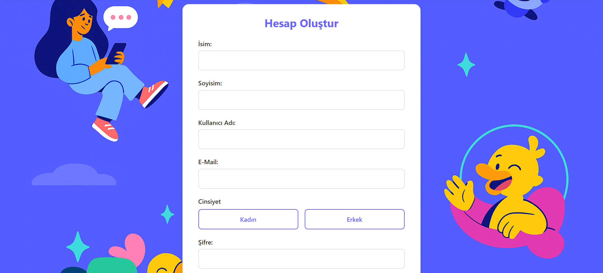
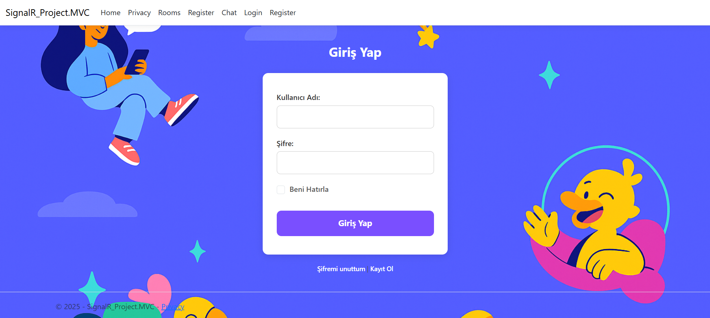
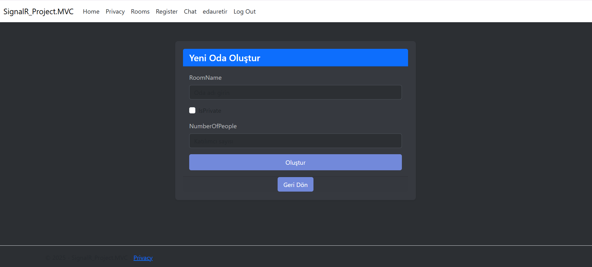
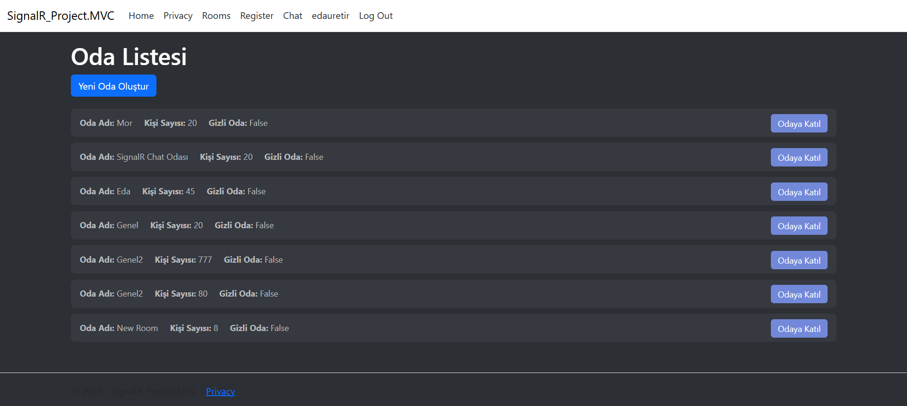
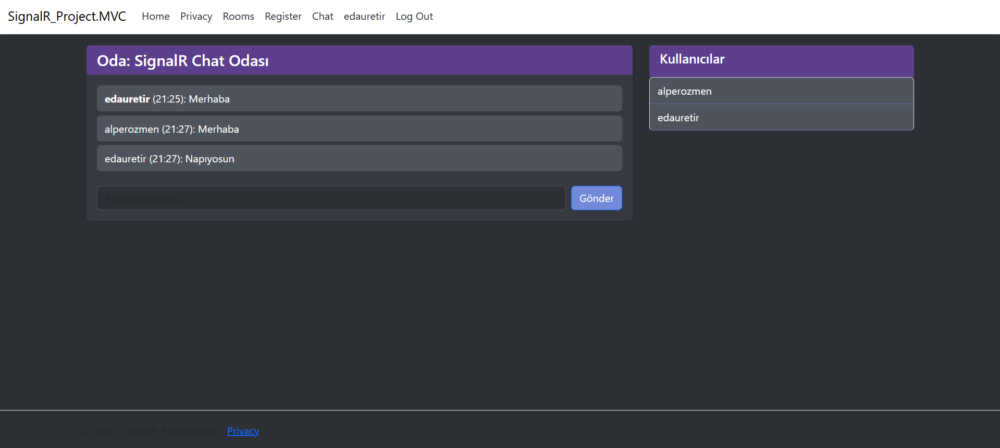

# SignalR Chat Application - ASP.NET Core MVC
 
**Bu proje, 1 haftada geliştirilmiş gerçek zamanlı chat uygulamasıdır.  
Kullanıcılar Identity ile kayıt olup giriş yapabilir, odalara katılabilir ve mesajlaşabilir.**  
 
---
 
## Rolüm  
- **Developer** olarak backend ve frontend geliştirmelerini yaptım.  
- **IoC & Clean Code** prensipleri ve Onion Architecture uygulamalarını yönettim.  
 
---
 
## Teknolojiler & Özellikler  
- **Backend:** .NET, C#, ASP.NET MVC, EF Core, Identity  
- **Frontend:** HTML, CSS, JavaScript  
- **Diğer:** SignalR, AutoMapper, Azure, IoC & Dependency Injection, Clean Code  
 
---
 
## Mimari ve Prensipler  
- Onion Architecture  
- SOLID  
- IoC & Dependency Injection  
- AutoMapper  
- Clean Code  
 
---
 
## Katkılarım  
- SignalR Hub ve gerçek zamanlı mesajlaşma implementasyonu  
- Kullanıcı kayıt ve giriş yönetimi (Identity)  
- Oda oluşturma, listeleme ve geçiş sistemi  
- Online kullanıcı listesi ve mesaj geçmişi yönetimi  
- Azure üzerinde deploy edilebilir yapı  
 
---
 
### Kullanıcı Kayıt & Giriş
  
  
 
---
 
### Oda Listesi & Oluşturma

  
 
---
 
### Sohbet Ekranı & Online Kullanıcılar
  
 
---
 
> Daha fazla ekran görüntüsü için [readme_images klasörüne](readme_images/) bakabilirsiniz.
